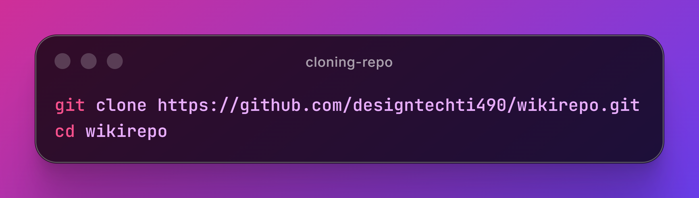
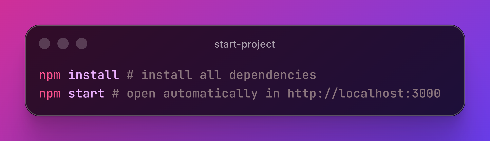

# 🗂️ WikiRepo

WikiRepo is a React application that allows you to search for public repositories on GitHub, save the results to a local list, and remove added items. Ideal for exploring favorite projects and keeping a quick history of accessed repositories.

## 🛠️ Features

- Search for GitHub repositories via public API (`username/repository`)
- Input format validation
- Prevents adding duplicate repositories
- Displays a list of searched repositories
- Removes repositories from the list
- Responsive layout with `styled-components`

## 🚀 Technologies used

&nbsp;
&nbsp;

## 📁 Main structure

- `src/pages/App.js` — main application logic and state
- `src/components/Input` — Input field for repository name
- `src/components/Button` — search button
- `src/components/ItemRepo` — display of each added repository
- `src/services/api.js` — Axios instance for communication with GitHub
- `public/index.html` — tab title and basic app configuration

## 💻 How to Setup

## ⚙️ How to run in development mode

## 🌐 View on hosting link

Check out the website by clicking here [WikiRepo](https://wikirepo-three.vercel.app/)

## 👤 Author

<table width="100%">

<tr>

<td align="center">

<a href="https://github.com/designtechti490">

 

<b>Marcelo Junior</b>
          <i>Front End Developer</i>

</a>

</td>

</tr>

</table>

---

 Developed with 💜 during Rocketseat's React Trail 

